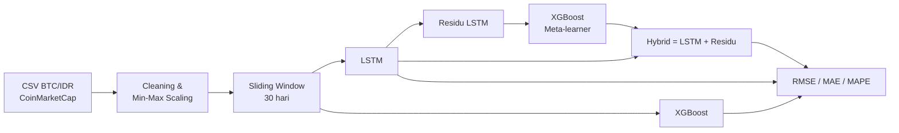
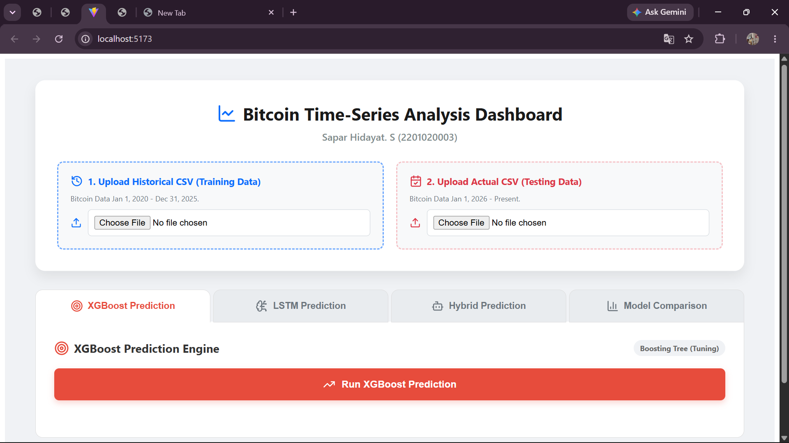
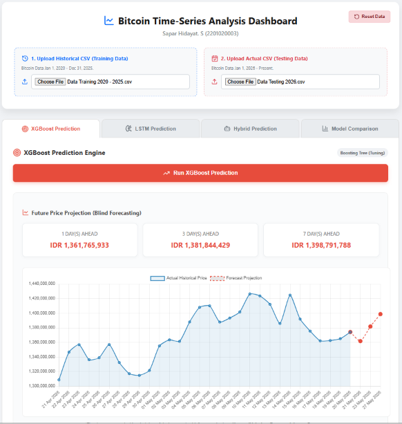
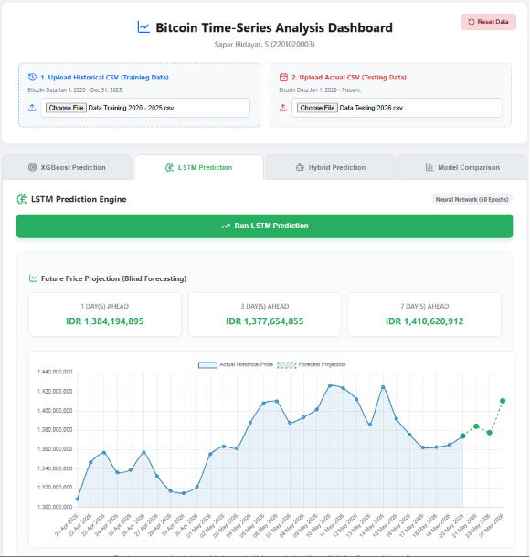
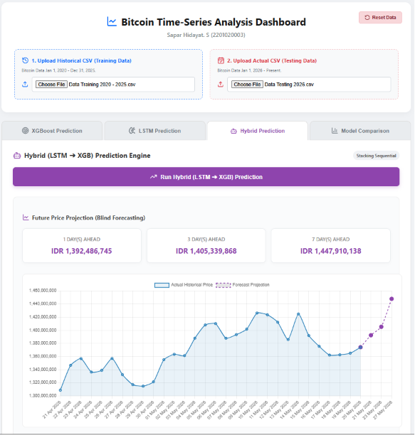
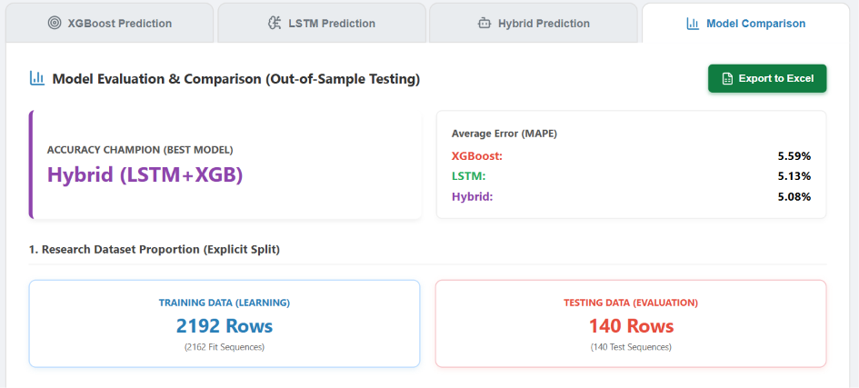

# Comparative Study of LSTM, XGBoost, and Hybrid Models for Bitcoin Price Forecasting

## Research Paper

**Authors:**
Sapar Hidayat. S, Novrizal Fattah Fahmitra, Tekad Matulatan

**Affiliation:**
Universitas Maritim Raja Ali Haji (UMRAH), Tanjungpinang, Indonesia  
Program Studi Teknik Informatika, Fakultas Teknik dan Teknologi Kemaritiman

**Year:**
2026

**Status:**
Disubmit ke *Scientific Journal of Informatics* (Universitas Negeri Semarang)

**Link to Paper:**
*Tautan artikel akan ditambahkan setelah terbit*

> Tugas Akhir terkait: **"Studi Komparatif Model LSTM, XGBoost, dan Hybrid Model Untuk Peramalan Harga Bitcoin"** — Sapar Hidayat. S (NIM 2201020003), Universitas Maritim Raja Ali Haji, 2026.

---

**Bitcoin Price Forecaster — Hybrid LSTM-XGBoost** adalah Sistem Pendukung Keputusan (*Decision Support System*/DSS) berbasis web untuk **peramalan harga Bitcoin (BTC/IDR)**. Proyek ini membandingkan tiga skema pemodelan deret waktu — **LSTM**, **XGBoost**, dan **Hybrid LSTM-XGBoost (Residual-Correction Stacking)** — menggunakan strategi **Direct Multi-Step Forecasting** untuk horizon 1, 3, dan 7 hari ke depan.

**Keterkaitan dengan penelitian.** Repositori ini adalah implementasi teknis dari penelitian pada artikel di atas (dan Tugas Akhir terkait). Seluruh model, pembagian data, dan angka evaluasi yang dilaporkan dalam **Laporan Tugas Akhir** (`LAPORAN_AKHIR_PUBLIKASI.pdf`) dan **draf artikel jurnal** berasal dari kode dan data di repositori ini. Berkas pendukung penelitian dikumpulkan di folder `docs/research/` (lihat [Artefak Penelitian](#artefak-penelitian)).

---

## Fitur Utama

- **Perbandingan 3 model** — LSTM (*base-learner*), XGBoost (*single* & *meta-learner*), dan Hybrid Stacking dalam satu dashboard.
- **Direct Multi-Step Forecasting** — model dilatih secara independen untuk tiap horizon (1, 3, 7 hari) guna menghindari akumulasi kesalahan (*error propagation*) khas pendekatan rekursif.
- **Residual-Correction Hybrid** — XGBoost mempelajari residu kesalahan LSTM ( `ŷ_hybrid = ŷ_LSTM + ê_XGBoost` ) untuk mengoreksi *over-smoothing* pada tren.
- **Chronological Split (anti data-leakage)** — data latih dan data uji dipisah secara runtun waktu, bukan acak (data latih 2020–2025, data uji 2026).
- **Blind Forecasting** — proyeksi harga ke depan menggunakan 30 hari data observasi terakhir.
- **Dashboard interaktif** — visualisasi *actual vs prediction*, grafik metrik kesalahan, dan halaman *Model Comparison*.
- **Ekspor laporan ke Excel** (`.xlsx`) berisi RMSE, MAE, MAPE, dan detail angka prediksi.

---

## Arsitektur

### Alur Metodologi



### Skema Hybrid (Residual-Correction Stacking)

```text
e_t      = y_(t+h) − ŷ_LSTM(t+h)      # residu LSTM pada data latih
ê_t      = XGBoost(X_t)               # XGBoost mempelajari residu tersebut
ŷ_hybrid = ŷ_LSTM + ê_XGBoost
```

### Arsitektur Sistem

```text
React (Vite, Chart.js, Axios) ── POST /api/predict ──►  Flask API (api.py)
   unggah CSV latih + uji                                 ├─ preprocessing & windowing
   pilih model, tampilkan grafik                          ├─ XGBoost / LSTM / Hybrid
   ekspor Excel (SheetJS)                                 └─ metrik + proyeksi (JSON)
```

---

## Dataset

**Type:** Data deret waktu harga harian Bitcoin (BTC/IDR)  
**Source:** CoinMarketCap  
**Period:** 1 Januari 2020 – 20 Mei 2026  
**Format:** `.csv` (pemisah titik koma; kolom `Tanggal`/`Date`, `Buka*`/`Open`, `Tutup**`/`Close`)

| Dataset | Periode | Jumlah observasi | Lokasi |
|---|---|---:|---|
| Data Latih | 1 Jan 2020 – 31 Des 2025 | 2.192 | `backend/data/Data Training 2020 - 2025.csv` |
| Data Uji | 1 Jan 2026 – 20 Mei 2026 | 140 | `backend/data/Data Testing 2026.csv` |

> Kedua file disertakan di repositori dan dapat langsung diunggah ke dashboard.

---

## Pengaturan Eksperimen

### Data & Pra-pemrosesan

| Tahap | Deskripsi |
|---|---|
| **Fitur masukan** | Harga *Open* dan *Close* (harga *High*, *Low*, dan *Volume* dieliminasi untuk mencegah multikolinearitas) |
| **Target** | Harga *Close* |
| **Normalisasi** | Min-Max Scaling ke rentang [0, 1], `scaler` di-*fit* hanya pada data latih |
| **Windowing** | *Sliding window* 30 hari |
| **Split data** | Latih: 1 Jan 2020 – 31 Des 2025 · Uji: 1 Jan 2026 – 20 Mei 2026 (*chronological split*) |
| **Horizon prediksi** | t+1, t+3, t+7 hari (Direct Multi-Step Forecasting) |
| **Random seed** | 42 |
| **Evaluasi** | RMSE, MAE, MAPE |

### Hyperparameter Model

| Hyperparameter | LSTM | XGBoost | Hybrid |
|---|---|---|---|
| Arsitektur | 2 layer LSTM × 50 unit, Dense(25), Dense(1) | Jendela diratakan (60 fitur) | LSTM (*base-learner*) + XGBoost (*meta-learner* atas residu) |
| Dropout | 0,2 | – | 0,2 (bagian LSTM) |
| Optimizer / Loss | Adam / MSE | – | Adam / MSE (bagian LSTM) |
| Batch size | 32 | – | 32 (bagian LSTM) |
| Epoch | 50 dengan *Early Stopping* (patience 5) | – | 50 dengan *Early Stopping* (patience 5) |
| Tuning | – | `RandomizedSearchCV` (3-fold, 15 iterasi, skor MAE negatif) | `RandomizedSearchCV` pada residu |

> Nilai di atas berlaku untuk `train.py` (pelatihan offline). Dashboard (`api.py`) memakai anggaran lebih ringan agar responsif: epoch maksimum 30, *patience* 3, dan 5 iterasi pencarian XGBoost.

### Eksperimen Parameter (Tuning)

Eksperimen terpisah dilakukan dengan data latih 2020–2024 (1.827 hari) dan validasi 2025 (365 hari), 20 percobaan per horizon untuk tiap algoritma, RMSE validasi sebagai metrik utama. Log lengkap: `docs/research/Eksperimen_Parameter_Log.xlsx`.

| Horizon | Model | Parameter terbaik | RMSE validasi (Rp juta) |
|---|---|---|---:|
| 1 | LSTM | 50 unit, dropout 0,1, lr 0,01, batch 16, epoch 14 | 37,32 |
| 1 | XGBoost | 300 pohon, lr 0,1, depth 3, subsample 0,8 | 184,59 |
| 3 | LSTM | 32 unit, dropout 0,1, lr 0,01, batch 16, epoch 13 | 57,44 |
| 3 | XGBoost | 100 pohon, lr 0,05, depth 3, subsample 0,7 | 214,69 |
| 7 | LSTM | 32 unit, dropout 0,2, lr 0,01, batch 32, epoch 9 | 85,04 |
| 7 | XGBoost | 100 pohon, lr 0,1, depth 3, subsample 0,8 | 217,63 |

---

## Hasil

### Ringkasan hasil (data uji 2026)

| Horizon | Model Terbaik (MAPE) | MAPE | RMSE (Rp) |
|---|---|---|---|
| 1 hari | LSTM | 3,64% | 62.927.542,68 |
| 3 hari | Hybrid LSTM-XGBoost | 4,23% | 73.769.422,33 |
| 7 hari | LSTM (MAPE) / **Hybrid (RMSE terendah)** | 6,77% / 6,90% | 116.982.086,30 / **114.341.538,60** |

LSTM unggul untuk peramalan jangka pendek karena mampu menangkap dependensi temporal, sedangkan Hybrid LSTM-XGBoost lebih stabil pada horizon menengah–panjang karena mekanisme koreksi residu menekan lonjakan kesalahan saat terjadi anomali harga.

### Perbandingan lengkap seluruh model

RMSE dan MAE dalam juta Rupiah; nilai terbaik per horizon dicetak tebal.

| Horizon | Model | RMSE | MAE | MAPE (%) |
|---|---|---:|---:|---:|
| 1 hari | XGBoost | 69,91 | 47,40 | 3,89 |
| | LSTM | **62,93** | **46,82** | **3,64** |
| | Hybrid | 69,36 | 52,38 | 4,12 |
| 3 hari | XGBoost | 85,15 | 64,78 | 5,23 |
| | LSTM | 83,55 | 64,34 | 4,99 |
| | Hybrid | **73,77** | **53,72** | **4,23** |
| 7 hari | XGBoost | 121,49 | 95,41 | 7,66 |
| | LSTM | 116,98 | **84,76** | **6,77** |
| | Hybrid | **114,34** | 86,61 | 6,90 |

### Proyeksi ke depan (*Blind Forecasting*)

Harga penutupan terakhir pada data: Rp1.374.193.726 (20 Mei 2026).

| Tanggal target | Horizon | XGBoost (Rp) | LSTM (Rp) | Hybrid (Rp) |
|---|---|---:|---:|---:|
| 21 Mei 2026 | t+1 | 1.361.765.933 | 1.384.194.895 | 1.392.486.745 |
| 23 Mei 2026 | t+3 | 1.381.844.429 | 1.377.654.855 | 1.405.339.868 |
| 27 Mei 2026 | t+7 | 1.398.791.788 | 1.410.620.912 | 1.447.910.138 |

### Metrik Evaluasi

- **RMSE** (*Root Mean Squared Error*) — memberi bobot lebih besar pada kesalahan bernilai besar (*outliers*).
- **MAE** (*Mean Absolute Error*) — rata-rata besaran kesalahan absolut.
- **MAPE** (*Mean Absolute Percentage Error*) — persentase kesalahan relatif terhadap nilai aktual.

---

## Visualisasi Dashboard

Klik untuk membuka tangkapan layar tiap halaman (berkas dari folder `docs/`).

<details>
<summary>Dashboard</summary>



</details>

<details>
<summary>Model XGBoost</summary>



</details>

<details>
<summary>Model LSTM</summary>



</details>

<details>
<summary>Model Hybrid</summary>



</details>

<details>
<summary>Evaluasi & Perbandingan Model</summary>



</details>

---

## Struktur Direktori

```text
bitcoin-prediction-lstm-xgboost/
├── backend/                    # Flask REST API & Machine Learning Pipeline
│   ├── data/                   # Dataset CSV (mentah, bersih, training, testing)
│   ├── models/                 # Model hasil training (.keras, .json) & scaler.pkl
│   ├── uploads/                # File CSV yang diunggah melalui dashboard
│   ├── utils/
│   │   ├── model_utils.py      # Definisi & pelatihan LSTM, XGBoost, Hybrid + metrik
│   │   ├── preprocessing.py    # Data cleaning & normalisasi
│   │   └── windowing.py        # Pembentukan sliding window (Direct Multi-Step)
│   ├── api.py                  # Entry point Flask Server (endpoint /api/predict)
│   ├── train.py                # Script training LSTM, XGBoost, dan Hybrid
│   ├── Dockerfile
│   └── requirements.txt
│
├── docs/                       # Tangkapan layar dashboard & artefak penelitian
│   └── research/               # Laporan TA, draf jurnal, log eksperimen, data hasil
│
├── frontend/                   # Dashboard React.js (Vite)
│   ├── src/
│   │   ├── App.jsx             # Komponen utama dashboard
│   │   ├── App.css / index.css
│   │   └── main.jsx
│   ├── package.json
│   └── vite.config.js
│
└── README.md
```

---

## Tech Stack

| Komponen | Teknologi | Fungsi |
|---|---|---|
| Backend & API | Python 3.10/3.11, Flask, Flask-CORS | Server komputasi & REST API |
| Deep Learning | TensorFlow / Keras | Membangun & melatih model LSTM |
| Machine Learning | XGBoost, Scikit-Learn | *Gradient boosting*, *hyperparameter tuning*, normalisasi |
| Data Processing | Pandas, NumPy | Manipulasi data & *sliding window* |
| Frontend & UI | React.js, Vite, Axios | *Single Page Application* & komunikasi API |
| Visualisasi | Chart.js (react-chartjs-2) | Grafik prediksi interaktif |
| Ekspor Data | SheetJS (XLSX), openpyxl | Ekspor laporan ke Excel |
| DevOps | Docker | Isolasi environment ML pada backend |

---

## Cara Menjalankan Aplikasi

### 1. Backend (Flask API via Docker)

Pastikan **Docker Desktop** sudah berjalan.

```bash
cd backend

# Build image (ulangi jika ada perubahan kode Python)
docker build -t btc-ai .

# Jalankan container
docker run -p 5000:5000 -v ${PWD}:/app btc-ai
```

Backend akan aktif di `http://localhost:5000`.

> Alternatif tanpa Docker: `pip install -r requirements.txt` lalu `python api.py` (disarankan menggunakan *virtual environment* Python 3.10+).

### 2. (Opsional) Melatih ulang model

```bash
cd backend
python train.py --train "data/Data Training 2020 - 2025.csv" --test "data/Data Testing 2026.csv"
```

Script ini akan menghasilkan model LSTM, XGBoost, dan Hybrid untuk horizon 1, 3, dan 7 hari, disimpan ke folder `backend/models/`.

### 3. Frontend (React Dashboard)

Gunakan terminal baru. Pastikan **Node.js** sudah terpasang.

```bash
cd frontend
npm install
npm run dev
```

Akses dashboard di `http://localhost:5173`.

### 4. Menggunakan Dashboard

1. Unggah **CSV data latih** dan **CSV data uji** pada panel *upload* (format kolom mengikuti data CoinMarketCap: `Tanggal`/`Date`, `Buka*`/`Open`, `Tutup**`/`Close`).
2. Pilih tab model (**XGBoost**, **LSTM**, atau **Hybrid**) lalu klik **Run Prediction** untuk melihat proyeksi 1, 3, dan 7 hari ke depan beserta grafiknya.
3. Buka tab **Model Comparison** untuk membandingkan RMSE, MAE, dan MAPE ketiga model, serta mengunduh laporan lewat **Export to Excel**.

---

## Artefak Penelitian

Berkas berikut mendokumentasikan penelitian yang diimplementasikan repositori ini (simpan di `docs/research/`):

| Berkas | Isi |
|---|---|
| `LAPORAN_AKHIR_PUBLIKASI.pdf` | Laporan Tugas Akhir lengkap (landasan teori, simulasi manual, pembahasan) |
| Draf artikel jurnal | Naskah yang disubmit ke *Scientific Journal of Informatics* |
| `Bitcoin_Analysis_Data.xlsx` | Hasil ekspor dashboard: metrik evaluasi, proyeksi, dan detail pengujian horizon 1 hari (sumber angka pada bagian Hasil) |
| `Eksperimen_Parameter_Log.xlsx` | Log eksperimen parameter LSTM dan XGBoost (data latih 2020–2024, validasi 2025), parameter terbaik, dan hasil uji ulang |

---

## Publikasi

Hasil penelitian ini telah disubmit ke **Scientific Journal of Informatics** (Universitas Negeri Semarang) dengan judul *"Comparative Study of LSTM, XGBoost, and Hybrid Models for Bitcoin Price Forecasting"*. Bukti publikasi dapat dilihat pada lampiran laporan Tugas Akhir.

---

## Penulis

**Sapar Hidayat. S** — NIM 2201020003  
Program Studi Teknik Informatika
Jurusan Teknik Elektro dan Informatika  
Fakultas Teknik dan Teknologi Kemaritiman
Universitas Maritim Raja Ali Haji (UMRAH), Tanjungpinang

Dibimbing oleh: **Novrizal Fattah Fahmitra** & **Tekad Matulatan**

---

© 2026 : Sapar Hidayat. S, Novrizal Fattah Fahmitra, Tekad Matulatan
